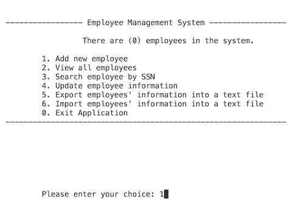

# Employee Management System

<!-- PROJECT LOGO -->
 

  <h3 align="center">Employment Management System</h3>

  

    An Employee Management System to handle employee data a little bit faster!
     
    <a href="https://github.com/karlasanc/employee-management-system">View Demo</a>
    ·
    <a href="https://github.com/karlasanc/employee-management-system/issues">Report Bug</a>
  

  
  
   

<!-- ABOUT THE PROJECT -->
## About The Project
The purpose of the Employment Management System is to provides a user-friendly interface for managing employee information, making it suitable for a range of small to medium-sized businesses and organizations that require a simple and cost-effective solution for HR management. 

### Built With
* VS Code
* Python

### Features
The application uses Python variables, input/output functions, selection, and repetition control structures to create a functional application that allows users to add, view, search, update, export, and import employee information. 
* Add New Employee: Allows users to input information for a new employee, including name, SSN(Social Security Number), phone number, email, and salary. The information is then stored in memory.
* View All Employees: Displays the details of all employees currently stored in the system in a formatted manner.
* Search Employee by SSN: Enables end user to search for an employee by providing their SSN. If found, the employee's details are displayed; otherwise, a message indicating that the employee was not found is shown.
* Update Employee Information: Allows user to update the information of an employee by searching for them using their SSN. If the employee is found, users can confirm whether they want to update the displayed employee information. If confirmed, users can enter the new information, including the name, phone number, email, and salary.
* Export Employees' Information Into a Text File: Writes the information of all employees currently stored in the system to a text file named "employee.txt" located outside the project folder.
* Import Employees' Information From a Text File: Reads employee information from an external file named "employee.txt" and populates the system with this data.
* Exit Application: Terminates the program.
  

(<a href="#readme-top">back to top</a>)

<!-- GETTING STARTED -->
## Getting Started

### Installation
To get a local copy of the application up and running follow these simple steps.
_This template doesn't rely on any external dependencies or services._

1. Clone or download the repository containing the Python script from Github to your local machine.
2. Navigate to the directory where you saved the script and open it using a text-editor or Integrated Development environment(IDE) like Visual Studio Code.
3. Execute the script using your preferred Python environment.

### Usage
![Project Screen Shot][main-menu-screenshot]
* Once the program is running, you will be presented with a menu option. Choose an option by entering the corresponding number and press Enter.

* Follow the prompts to add, view, search, update, export, and import emplouyee information as needed.
![Project Screen Shot][add-new-screenshot]

* Continue interacting with the program until you choose to exit by selecting the "0" option.
![Project Screen Shot][update-screenshot]

### Feature Roadmap
I am working on adding the following featues:
- [ ] Add Error Handlers
- [ ] Multi-language Support
    - [ ] Spanish
     

(<a href="#readme-top">back to top</a>)

<!-- MARKDOWN LINKS & IMAGES -->
[main-menu-screenshot]: images/main_menu.png
[add-new-screenshot]: images/add_new.png
[update-screenshot]: images/update.png
